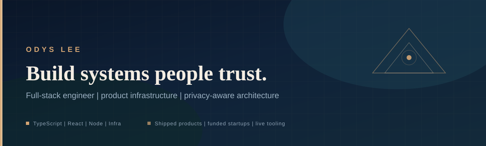
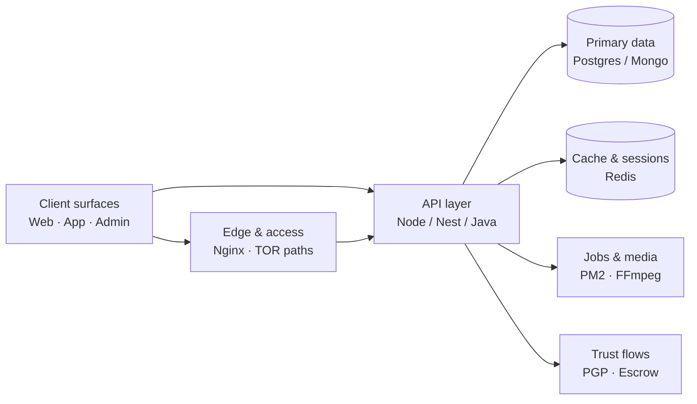
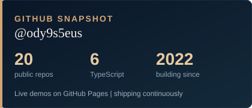
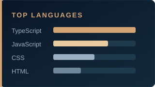

<!--
  Profile: Odys Lee (@ody9s5eus)
  Intent: signal craft, ownership, and production judgment in under 10 seconds.
-->

<p align="center">
  
</p>

<p align="center">
  <a href="mailto:ody9s5eus@icloud.com"></a>
</p>

<p align="center">
  <a href="https://ody9s5eus.github.io/readme-generator/"></a>
  <a href="mailto:ody9s5eus@icloud.com"></a>
  <a href="https://github.com/ody9s5eus"></a>
</p>

---

### Who I am

**Odys Lee** — full-stack engineer who owns the path from prototype to production.

I build product surfaces people enjoy using, and the infrastructure that keeps them reliable: APIs, data stores, CI/CD, bare-metal and cloud ops. I’ve helped startups ship fundable demos and scale past the “it works on my machine” stage — including work that contributed to **~$5M in raised capital**.

I care about **latency, correctness, and trust**. Pretty UI without a solid system underneath is just a demo.

---

### What I optimize for

| Signal | How it shows up in my work |
| --- | --- |
| **Ship velocity** | Tight loops: TypeScript end-to-end, Vite/React for UI, Node/Nest for services |
| **Production reality** | Docker, PM2, Nginx, CI/CD, Ubuntu/RHEL — not just local happy paths |
| **Data that survives** | PostgreSQL, MongoDB, Redis; schema decisions that don’t paint you into a corner |
| **Trust & privacy** | PGP messaging, TOR-aware delivery, escrow flows — security as product, not a checkbox |
| **Craft** | Tools with live demos, typed interfaces, and readable architecture |

---

### How I think about a product system



---

### Featured work

<table>
<tr>
<td width="50%" valign="top">

#### Domestic Monerochan (DMC)
**Privacy-first community platform** · production product

Image-board style forum with account identity, **PGP-encrypted DMs**, board permissions, media, and **XMR escrow** trading flows — designed for anonymity-preserving communities.

- TOR-aware access paths  
- Server + app + ops ownership  
- [domesticmonerochan.org](https://domesticmonerochan.org)

</td>
<td width="50%" valign="top">

#### Developer tools (live)
**DX products** · TypeScript / React / Vite

Small tools that remove friction for builders — shipped with real previews, not README vaporware.

- [README Generator](https://ody9s5eus.github.io/readme-generator/) — templates + live markdown preview  
- [TS Mock Gen](https://ody9s5eus.github.io/ts-mock-gen/) — interfaces → realistic JSON  
- [Markdown → Slides](https://ody9s5eus.github.io/instant-markdown-to-slides/) — write left, present right  

</td>
</tr>
<tr>
<td width="50%" valign="top">

#### Image Converter
**In-browser media pipeline** · React + TypeScript

Upload → resize → crop → blur/redact → export (JPEG / PNG / WebP). Privacy-sensitive edits stay on the client.

- [Repository](https://github.com/ody9s5eus/image-converter)

</td>
<td width="50%" valign="top">

#### Interaction & graphics
**Product feel experiments**

- [Interactive Task Bubble](https://ody9s5eus.github.io/interactive-task-bubble/) — Matter.js physics tasks  
- [Solar System](https://ody9s5eus.github.io/solar-system-simulation/) — Three.js / R3F  
- [Color Palette](https://ody9s5eus.github.io/color-palette-generator/) — contrast-aware generator + Vitest  

</td>
</tr>
</table>

---

### Stack (what I reach for first)

```text
Languages     TypeScript · JavaScript · Java · Swift · Kotlin
Product UI    React · Next.js · Vue · Nuxt · React Native
Services      Node.js · NestJS · Spring Boot
Data          PostgreSQL · MongoDB · Redis
Delivery      Docker · Kubernetes · Nginx · PM2 · GitHub Actions / CI
Platforms     AWS · bare-metal · Ubuntu · RHEL / CentOS
Media         FFmpeg · browser image pipelines
```

<details>
<summary><strong>Badge strip</strong> (for scanners who like logos)</summary>
<br/>


</details>

---

### Operating principles

1. **Done time beats clever time** — ship the honest MVP, then harden what users actually touch.  
2. **Own the failure domain** — if it can break in prod, I’ve already thought about logs, restarts, and rollback.  
3. **UX is a system property** — performance, permissions, and copy are part of the same design.  
4. **Security is product** — encryption, identity, and threat models belong in the roadmap, not a postmortem.

---

### Snapshot

<p align="center">
  
  &nbsp;&nbsp;
  
</p>

---

### Let’s build

Open to **full-stack / platform / product engineering** roles where ownership matters.

**Email:** [ody9s5eus@icloud.com](mailto:ody9s5eus@icloud.com)

> *“Runtime is important. Done time is important as well.”*
